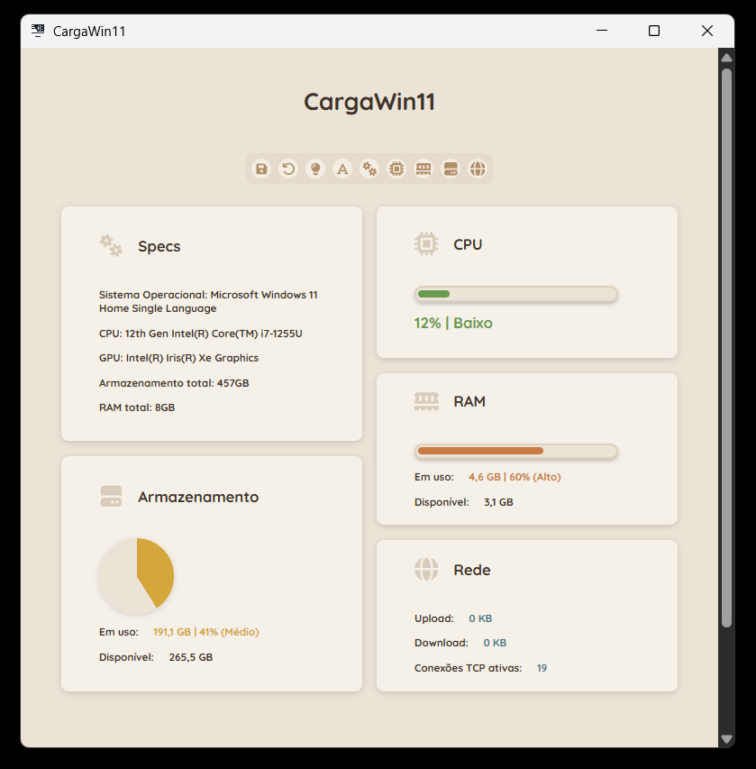
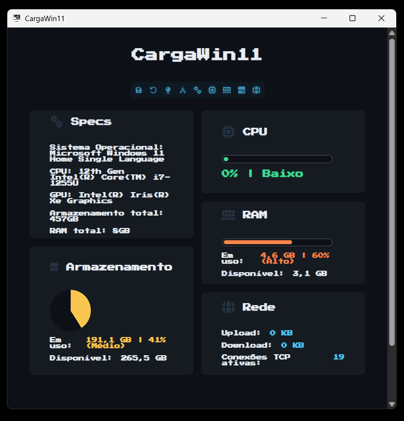

# 📊 CargaWin11

Aplicação nativa/híbrida para Windows 11 que permite ao usuário visualizar métricas do sistema operacional. O projeto foi inspirado em ferramentas como o Gerenciador de Tarefas do Windows e o Conky, disponível para sistemas Unix-like.

O objetivo do aplicativo é exibir informações em tempo real sobre CPU, memória RAM, armazenamento e rede por meio de uma interface gráfica dinâmica, moderna e personalizável. O usuário pode escolher entre diferentes temas de cores e fontes, além de definir quais cartões de informações deseja visualizar no dashboard.

A aplicação foi desenvolvida com o ecossistema .NET. Por utilizar Blazor Hybrid, a interface de usuário é executada em uma WebView nativa e construída com tecnologias web, combinando a experiência de uma aplicação desktop com a flexibilidade do desenvolvimento frontend moderno.

---

## 🚀 Recursos
- Coleta de dados sobre a carga do sistema com WMI e outras bibliotecas C#
- Monitoramento de carga de:
  - CPU
  - RAM
  - Armazenamento no disco C:
  - Rede:
    - Upload (Kbps)
    - Download (Kbps)
    - Conexões TCP ativas
- Atualização em tempo real do dashboard
- Visualização de carga do sistema através de gráficos e textos na interface
- Personalização da interface pelo usuário através de temas e fontes pré definidos
- Salvar preferências do usuário em arquivos JSON

## 🛠️ Tecnologias utilizadas
- .NET 8:
  - C#
  - WPF
  - Blazor
- Web:
  - HTML
  - CSS
  - JavaScript
